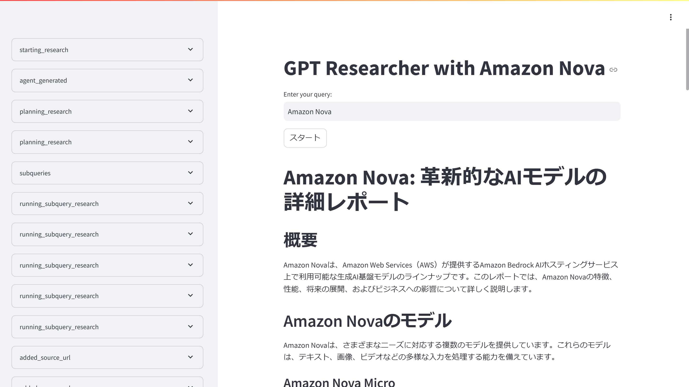

# GPT Researcher with Amazon Nova

GPT ResearcherをAmazon Novaで動作させるサンプルWebアプリです。



## 環境構築

ソースコードをクローンします

```shell
git clone https://github.com/moritalous/gpt-researcher-with-amazon-nova.git
cd gpt-researcher-with-amazon-nova/
```

Pythonの仮想環境を作成します

```shell
python -m venv .venv
source .venv/bin/activate
```

ライブラリーをインストールします

```shell
pip install -r requirements.txt 
```

環境変数の定義ファイルを作成し、`TAVILY_API_KEY`にTavily APIのAPIキーを指定します

```shell
cp .env.sample .env
```

Streamlitを起動します

```
streamlit run app.py
```
